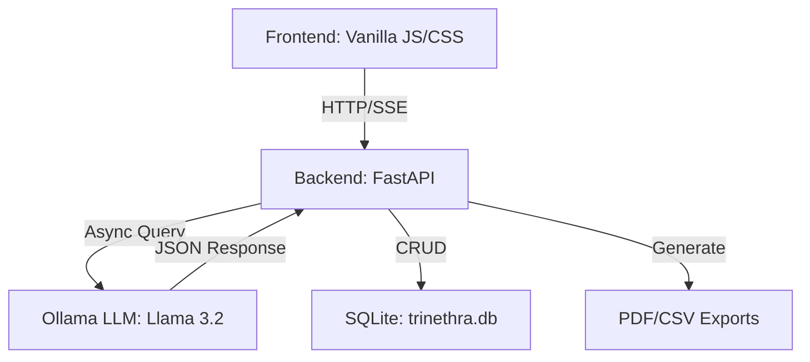

# 👁️ Trinethra Analyzer: Professional AI Supervisor Feedback Suite

[](https://fastapi.tiangolo.com/)
[](https://ollama.ai/)
[](https://developer.mozilla.org/en-US/docs/Web/JavaScript)
[](https://www.sqlite.org/)

**Trinethra Analyzer** is a state-of-the-art AI platform designed for organizational psychologists and HR professionals to analyze supervisor feedback transcripts for Fellows placed in Indian manufacturing MSMEs. It transforms raw text into structured behavioral insights, performance scores, and business KPI mappings.

**🔗 [Live Demo](https://trinethra-analyzer.onrender.com/)**

---

## 🏗️ System Architecture

The project follows a decoupled architecture with a focus on real-time feedback and asynchronous processing.



---

## ✨ Advanced Features

### 1. Multi-Prompt AI Pipeline
Unlike simple chatbots, Trinethra uses a 5-stage sequential pipeline for maximum accuracy:
- **Evidence Extraction**: Identifies quotes and categorizes them by behavioral dimensions.
- **Scoring Engine**: Applies a professional 1-10 rubric with confidence levels.
- **KPI Mapping**: Connects feedback to 8 critical business KPIs (OTD, Productivity, etc.).
- **Gap Analysis**: Identifies what dimensions were *not* discussed in the transcript.
- **Follow-up Generation**: Creates targeted questions for the next supervisor call.

### 2. Intelligent Dashboard
- **Aggregate Analytics**: Real-time tracking of average scores and top performance indicators.
- **Streaming UI**: Live progress bar and step-by-step updates as the AI processes each stage.
- **History Management**: Browse, search, and delete previous analysis records.

### 3. Professional Reporting
- **PDF Reports**: Branded, auto-generated PDF reports with detailed scoring justifications and evidence quotes.
- **Bulk CSV Export**: Export historical data for external analysis in Excel/Tableau.

---

## 📂 Project Structure

```text
trinethra-analyzer/
├── backend/                # FastAPI Application
│   ├── app.py              # Main API entry point & routes
│   ├── database.py         # SQLite & SQLAlchemy logic
│   ├── prompts.py          # AI Prompt Engineering
│   ├── utils.py            # JSON parsing & validation
│   └── trinethra.db        # Local persistence
├── frontend/               # Web Interface
│   ├── index.html          # Main dashboard
│   ├── script.js           # Real-time UI logic
│   └── style.css           # Premium glassmorphic styling
├── data/                   # Sample transcripts for testing
├── run.py                  # Automated orchestration script
├── start.bat               # Windows quick-launch
└── Dockerfile              # Containerization config
```

---

## 🛠️ API Documentation

| Method | Endpoint | Description |
| :--- | :--- | :--- |
| `GET` | `/health` | Check service health & Ollama connection |
| `POST` | `/analyze` | Run full analysis (Synchronous) |
| `POST` | `/analyze/stream` | Run full analysis (Real-time Streaming) |
| `GET` | `/history` | Fetch analysis history (limit 20-100) |
| `GET` | `/stats` | Get dashboard overview statistics |
| `GET` | `/export/{id}` | Generate and download PDF report |
| `GET` | `/export/csv` | Download all data as CSV |
| `DELETE` | `/analysis/{id}` | Remove an analysis record |

---

## 🚀 Installation & Setup

### 1. Prerequisites
- **Python 3.9+**
- **Ollama**: [Download here](https://ollama.ai/download)
- **Model**: `ollama pull llama3.2`

### 2. Configuration (`.env`)
Create a `.env` in the `backend/` folder:
```bash
OLLAMA_URL=http://localhost:11434
OLLAMA_MODEL=llama3.2
MOCK_MODE=false # Set to true to test UI without LLM
```

### 3. Quick Launch (Recommended)
Just run the master script; it handles port cleanup, dependencies, and launches both servers:
```bash
python run.py
```

---

## 📋 Assessment Rubric

The AI evaluates Fellows based on:
1. **Reliability & Consistency**
2. **Work Quality**
3. **Initiative & Ownership**
4. **Systems Building**
5. **Team Integration**
6. **Communication**
7. **Problem-Solving**
8. **Business Impact**

---

## 📬 Contact & Professional Support

**Aman Varma**  
Lead Developer & AI Architect

- **GitHub**: [Aman Varma](https://github.com/Amanvarma2231)
- **LinkedIn**: [Aman Varma](https://www.linkedin.com/in/aman-v-697771345)
- **Email**: [amangurauli@gmail.com](mailto:amangurauli@gmail.com)
- **Live Demo**: [Trinethra Analyzer](https://trinethra-analyzer.onrender.com/)
- **Portfolio**: [Aman Varma](https://aman-varma.onrender.com/)

---

## 📄 License

This project is licensed under the MIT License - see the [LICENSE](LICENSE) file for details.